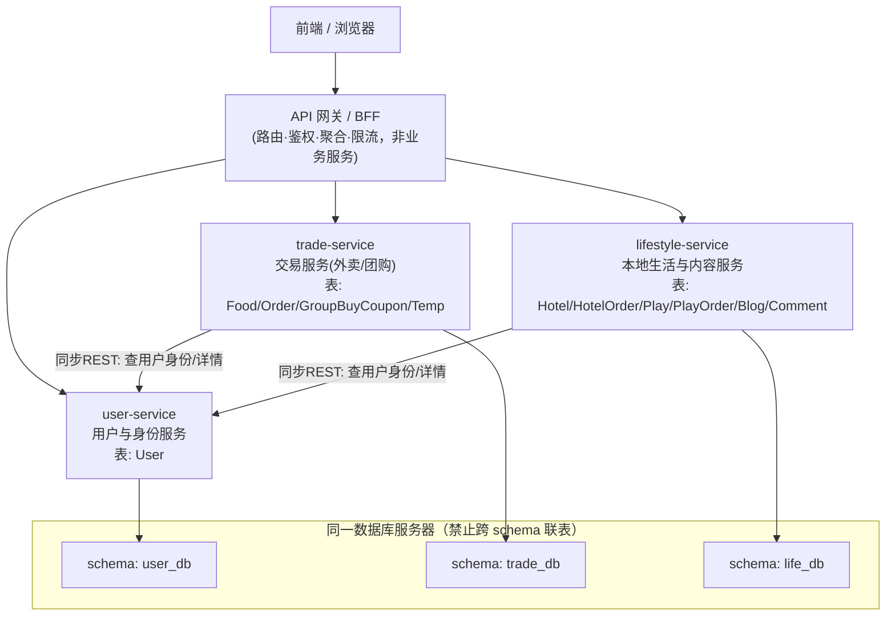

# 后端微服务拆分方案

> 将单体 Django 应用（`01_source/myapp`）拆分为 3 个业务微服务。
> API 网关、注册中心、配置中心、前端、数据库**不计入**这 3 个业务微服务。

---

## 一、微服务划分图

### 1.1 划分图（Mermaid）



### 1.2 划分图（ASCII）

```
                 ┌──────────────────────────┐
                 │      前端 / 浏览器         │
                 └────────────┬─────────────┘
                              │ HTTPS
                 ┌────────────▼─────────────┐
                 │     API 网关 / BFF        │  ← 路由·鉴权·聚合·限流（不算业务服务）
                 └───┬──────────┬───────┬───┘
        ┌────────────▼────┐ ┌───▼──────────────┐ ┌───▼───────────────────┐
        │  user-service    │ │  trade-service    │ │  lifestyle-service     │
        │  用户与身份服务    │ │  交易服务(外卖/团购)│ │  本地生活与内容服务      │
        │  ──────────────  │ │  ──────────────  │ │  ───────────────────   │
        │  表: User        │ │  表: Food        │ │  表: Hotel HotelOrder   │
        │  UC01 注册/登录/  │ │      Order       │ │      Play  PlayOrder    │
        │       角色/账号   │ │      GroupBuy    │ │      Blog  Comment      │
        │                 │ │      Temp        │ │  UC04/05/06/07          │
        │  UC09(用户治理)   │ │  UC02/03/06      │ │  UC09(内容审核)          │
        └────────┬─────────┘ └────────┬─────────┘ └─────────┬──────────────┘
                 │                    │                     │
        ┌────────▼────────┐ ┌─────────▼────────┐ ┌──────────▼─────────┐
        │  schema: user    │ │  schema: trade   │ │  schema: life      │
        └─────────────────┘ └──────────────────┘ └────────────────────┘
           └────────── 同一数据库服务器 · 禁止跨 schema 联表 ──────────┘

依赖箭头：trade-service ──实线──▶ user-service（查用户/身份）
          lifestyle-service ──实线──▶ user-service（查用户/身份）
          BFF ──并发──▶ 三个服务（个人中心、管理后台、AI 聚合）
```

---

## 二、三个微服务划分与理由

| 服务 | 负责业务 | 拥有的表 | 对应用例 |
|---|---|---|---|
| **user-service 用户与身份服务** | 账号注册、登录、会话、角色判定、账号状态/角色治理 | `User` | UC01、UC09(用户治理部分) |
| **trade-service 交易服务** | 外卖下单/购物车/团购券/配送履约/评价 + 商家菜品供给维护 | `Food` `Order` `GroupBuyCoupon` `Temp` | UC02、UC03、UC06(美食部分) |
| **lifestyle-service 本地生活与内容服务** | 酒店预订、娱乐门票、社区博客评论 | `Hotel` `HotelOrder` `Play` `PlayOrder` `Blog` `Comment` | UC04、UC05、UC06(酒店/娱乐部分)、UC07、UC09(内容审核部分) |

### 为什么这样分

1. **user-service 单独拆**：账号是横切基础能力，被所有业务依赖。独立后认证、风控、账号治理可单独演进，其他服务不再各自重复实现登录逻辑。
2. **trade-service 是核心、状态机最复杂**：外卖订单 `pos 0→5` 要**用户/商家/骑手三方**协作流转，一致性要求最高，应独立以便高并发扩容。关键点——`Food.sale/saleperson` 销量统计由 `Order` + `GroupBuyCoupon` 聚合（`sync_food_sales`），**把 `Food` 和 `Order` 放在同一服务，销量同步就是同服务内事务，无需跨服务事件**，省掉一整套跨服务写。
3. **lifestyle-service 合并酒店+娱乐+社区**：酒店/娱乐都是「到店消费」模式（下单→到店→评价，**没有配送状态机**），与外卖有本质区别；社区是低频内容互动。三者复杂度低、流量分散，合并不增加耦合，反而减少运维成本。

> 备选：若想更彻底解耦，可把 trade 再拆成 catalog(商品) + order(订单)，但会引入「订单→商品销量」的跨服务事件同步，复杂度明显上升。**3 个是当前最平衡的选择**。

---

## 三、数据表归属表

11 张表全部明确归属，**其他服务一律通过接口访问，禁止直连表**：

| 表（模型） | 业务含义 | 归属服务 | 跨服务外键处置 |
|---|---|---|---|
| User | 账号/角色/状态 | user-service | — |
| Food | 美食菜品 | trade-service | `merchant`→存 `merchant_id`（原指向 User） |
| Order | 外卖订单 | trade-service | `user`/`rider`→存 `user_id`；`food` 同服务保留外键 |
| GroupBuyCoupon | 团购券 | trade-service | `user`→`user_id`；`food` 同服务保留 |
| Temp | 外卖购物车 | trade-service | `user`→`user_id`；`food` 同服务保留 |
| Hotel | 酒店 | lifestyle-service | `merchant`→`merchant_id` |
| HotelOrder | 酒店订单 | lifestyle-service | `user`→`user_id` |
| Play | 娱乐场所 | lifestyle-service | `merchant`→`merchant_id` |
| PlayOrder | 娱乐门票订单 | lifestyle-service | `user`→`user_id` |
| Blog | 博客 | lifestyle-service | `authorid`→`author_id` |
| Comment | 评论 | lifestyle-service | `userid` 已是裸 id |

**规则**：跨服务外键一律降级为「裸 ID」，需要详情时调对方服务接口解析；同服务内保留真实外键与联表。

---

## 四、服务接口清单

### 4.1 user-service（用户与身份服务）

| 方法 | 路径 | 说明 | 原实现 |
|---|---|---|---|
| POST | `/register` | 注册（普通/骑手/商家） | `views.register` |
| POST | `/login` | 登录，返回 JWT | `views.login` |
| POST | `/logout` | 登出、清会话 | `views.logout_view` |
| GET | `/users/{id}` | 查询用户信息（供其他服务用） | — |
| PATCH | `/users/{id}/profile` | 改手机号/签名 | `views.space`(POST 分支) |
| PATCH | `/users/{id}/status` | 停用/启用（治理） | `admin_views.admin_user_action` |
| PATCH | `/users/{id}/role` | 改角色（治理） | `admin_views.admin_user_action` |
| GET | `/internal/users?ids=` | 批量查用户（供列表页显示用户名） | — |

### 4.2 trade-service（交易服务）

| 方法 | 路径 | 说明 | 原实现 |
|---|---|---|---|
| GET | `/foods?q=` | 菜品列表/搜索 | `views.food` |
| GET | `/foods/{id}` | 菜品详情 | `views.fooddetails` |
| POST | `/foods` | 商家发布美食 | `views.foodsend` |
| PATCH | `/foods/{id}/status` | 上下架/售罄 | `views.merchant_food_action` |
| POST | `/orders` | 直接下单 | `views.foodorder` |
| GET | `/orders/{id}` | 订单状态查询 | `views.orderpos` |
| POST | `/orders/{id}/comment` | 订单评价 | `views.ordercomment` |
| POST | `/cart` | 加入购物车 | `views.foodorder`(cutlery=2) |
| PATCH | `/cart/{id}` | 改购物车数量/地址 | `views.update_cart_item` |
| DELETE | `/cart/{id}` | 删购物车条目 | `views.delete_cart_item` |
| POST | `/cart/checkout` | 购物车结算 | `views.clear_cart` |
| POST | `/groupbuy` | 买团购券 | `views.groupbuyorder` |
| POST | `/groupbuy/redeem` | 商家核销 | `views.groupbuy_redeem` |
| GET | `/rider/orders` | 骑手可接单列表 | `service_views.rider_orders` |
| POST | `/orders/{id}/accept` | 骑手接单 | `service_views.rider_accept` |
| POST | `/orders/{id}/prepare` | 商家出餐 | `service_views.merchant_prepare` |
| POST | `/orders/{id}/pickup` | 骑手取餐 | `service_views.rider_get` |
| POST | `/orders/{id}/deliver` | 骑手送达 | `service_views.rider_deliver` |

### 4.3 lifestyle-service（本地生活与内容服务）

| 方法 | 路径 | 说明 | 原实现 |
|---|---|---|---|
| GET/POST | `/hotels` | 酒店列表 / 商家发布 | `service_views.hotel`/`hotelsend` |
| GET | `/hotels/{id}` | 酒店详情 | `service_views.hoteldetails` |
| POST | `/hotel-orders` | 订酒店 | `service_views.hotelorder` |
| GET | `/hotel-orders/{id}` | 订单状态 | `service_views.hotelorderpos` |
| POST | `/hotel-orders/{id}/comment` | 评价 | `service_views.hotelcomment` |
| GET/POST | `/plays` | 娱乐列表 / 发布 | `service_views.play`/`playsend` |
| GET | `/plays/{id}` | 娱乐详情 | `service_views.playdetails` |
| POST | `/play-orders` | 购票 | `service_views.playorder` |
| GET | `/play-orders/{id}` | 订单状态 | `service_views.playorderpos` |
| POST | `/play-orders/{id}/comment` | 评价 | `service_views.playcomment` |
| GET/POST | `/blogs` | 博客列表 / 发布 | `views.blog`/`blogsend` |
| GET | `/blogs/{id}` | 博客详情+评论 | `views.blogsdetails` |
| POST | `/blogs/{id}/comments` | 发评论 | `views.blogcomment` |
| DELETE | `/blogs/{id}` `/comments/{id}` | 逻辑删除 | `views.delete_blog`/`delete_comment` |

### 4.4 聚合层（BFF，非业务服务，不拥有表）

- `GET /space`（个人中心）：**并发调** trade-service（订单/团购/购物车）+ lifestyle-service（酒店/娱乐订单/博客）+ user-service（个人资料）。
- `GET /manage`（管理后台）：并发调三个服务各自的治理接口，汇总统计。
- `POST /ai-chat`：调 trade-service(菜品目录) + lifestyle-service(酒店/娱乐目录) + user-service(订单历史) 拼上下文。

---

## 五、跨服务调用说明与失败处理

| 跨服务场景 | 调用方式 | 失败处理 |
|---|---|---|
| 下单/评价前校验身份、判断商家/骑手角色 | **JWT 声明携带 `user_id`+`usertype`**，服务本地解析，**不实时调 user-service** | JWT 无效/过期 → 401；user-service 宕机不影响已有合法 token 的请求 |
| 列表页显示用户名（如博客作者、评论者） | 调 user-service `/internal/users?ids=` 批量查 | 失败 → 显示「匿名用户」占位，**不阻断主流程**（与现代码 `user.username if user else "匿名用户"` 一致） |
| 下单时需菜品价格/状态 | **无**：Food 与 Order 同在 trade-service | — |
| 销量统计 `sync_food_sales` | **无**：Food/Order/GroupBuy 同在 trade-service，走同库事务 | — |
| 酒店/娱乐 `orders+1`、评分重算 | 同服务内事务 | — |
| 个人中心/管理后台聚合 | BFF **并发**调用，可用「单点降级」 | 某一服务超时/失败 → 返回该块空数据 + 提示，不整体 500 |
| AI 咨询聚合目录 | 先读缓存，未命中再调各服务 | 任一目录服务失败 → 用缓存兜底；全部失败 → 500「AI 服务暂不可用」 |

**关键设计决策**：把高频的角色判断（`is_merchant`/`is_rider`）从「同步查库」改为「JWT 声明」，把真正的同步跨服务调用收敛到**低频的批量查用户名**和**聚合层**，既满足「跨服务用接口/事件」的约束，又避免下单链路被 user-service 拖累。
